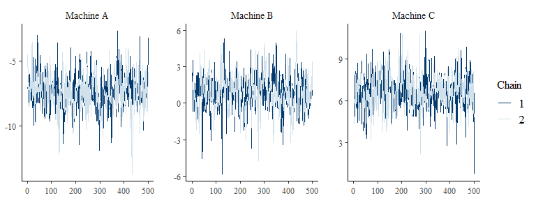

<!-- README.md is generated from README.Rmd. Please edit that file -->

# stanova

<!-- badges: start -->

[](https://travis-ci.org/bayesstuff/stanova)
[](https://github.com/bayesstuff/stanova/actions)
<!-- badges: end -->

The goal of `stanova` is to provide a more relevant and interpretable
`summary` for Bayesian models with categorical covariates and possibly
interactions and continuous covariates estimated in `Stan`. The core
functions are `stanova()` which requires specifying which `rstanarm`
function should be called through argument `model_fun` (e.g., `model_fun
= glmer` calls `stan_glmer` and allows fitting Bayesian mixed models)
and `stanova_brm()` which estimates models using `brms::brm()`.

The issue `stanova` tries to address is that categorical variables with
\(k\) levels need to be transformed into \(k-1\) numerical model
coefficients. This poses a problem if a model includes a factor with
more than two levels that interacts with another variable. In this case,
the most reasonable parameterization of the model is such that the
intercept correspond to the (unweighted) grand mean and therefore
estimates of the coefficients for the main effects represent average
effects (compared to simple effects). In this parameterization, factors
with \(k\) levels, where \(k > 2\) (i.e., more than two levels), cannot
be mapped in a 1-to-1 fashion to the \(k-1\) coefficients as no such
mapping exists. Thus, the estimates of the model coefficients do not
represent effects of one factor level, but always pertain to more than
one factor level and thus cannot be directly interpreted. In other
words, these coefficients should not be looked at. Instead, `stanova`
transforms these parameters back such that one gets the information on
the factor levels (or combination of factor levels for interactions).
The default output shows for each factor level the difference from the
intercept which as discussed before corresponds to the (unweighted)
grand mean.

Another problem adressed by `stanova` is that for Bayesian models the
mapping of factor-levels to model coefficients needs to be done such
that the marginal prior for each factor-level is the same. If one uses
one of the contrast coding schemes commonly used in frequentist models
in which the intercept corresponds to the (unweighted) grand mean the
marginal prior differs across factor levels. For example, when using
`contr.sum` all but the last factor level are mapped to exactly one
model coefficient with positive sign, and the last factor level is
mapped with negative sign on all model coefficients. Thus, the marginal
prior for the last factor level is more diffuse than for the other
factor levels (if \(k >2\)). `stanova` per default uses the contrast
coding scheme suggested by Rouder, Morey, Speckman, and Province (2012)
which is such that the marginal prior is the same for all factor levels.
When using this contrast, the sum-to-zero constraint that is necessary
for the intercept to represent the (unweighted) grand mean is also
imposed. This contrast is implemented in the `contr.bayes()` function.

## Installation

For the moment, you can only install the development version from
[GitHub](https://github.com/) with:

``` r
# install.packages("devtools")
devtools::install_github("bayesstuff/stanova")
```

`stanova` attaches the new contrasts to the model instead of to the data
if `rstanarm` version `2.21.2`, which is not yet on CRAN, is installed
from source:

``` r
Sys.setenv("MAKEFLAGS" = "-j4")  ## uses 4 cores during installation
devtools::install_github("stan-dev/rstanarm", build_vignettes = FALSE)
```

Also, at least version `1.5.0` of `emmeans` is needed which can be
installed from CRAN:

``` r
install.packages("emmeans")
```

## `rstanarm` Example

The most basic example only uses a single factor with three levels to
demonstrate the output.

``` r
library(stanova)
data("Machines", package = "MEMSS")

m_machines <- stanova(score ~ Machine + (Machine|Worker),
                      model_fun = "glmer",
                      data=Machines, chains = 2,
                      warmup = 250, iter = 750)
```

The `summary` method of a `stanova` objects first provides some general
information about the fitted model (similar to `rstanarm`). It then
provides statistics about the intercept. The next block provides
estimates for each factor-level of the `Machine` factor. These estimates
represent the difference of the factor level against the intercept. For
example, for `Machine A`, the estimate is around `-7` suggesting that
the mean of this factor level is 7 points below the intercept (i.e., the
grand mean).

``` r
summary(m_machines)
#> 
#> Model Info:
#>  function:     stanova_glmer
#>  family:       gaussian [identity]
#>  formula:      score ~ Machine + (Machine | Worker)
#>  algorithm:    sampling
#>  chains:       2
#>  sample:       1000 (posterior sample size)
#>  priors:       see help('prior_summary', package = 'rstanarm')
#>  observations: 54
#>  groups:       Worker (6)
#> 
#> Estimate Intercept:
#>      Variable   Mean MAD_SD     5%    50%    95%  rhat ess_bulk ess_tail
#> 1 (Intercept) 59.647  1.828 56.341 59.650 62.669 1.006  293.768  374.665
#> 
#> 
#> Estimates 'Machine' - difference from intercept:
#>    Variable   Mean MAD_SD     5%    50%    95%  rhat ess_bulk ess_tail
#> 1 Machine A -7.235  1.186 -9.256 -7.258 -5.136 1.003  479.828  567.431
#> 2 Machine B  0.667  1.317 -1.656  0.620  3.163 1.003  249.062  327.872
#> 3 Machine C  6.568  1.111  4.233  6.659  8.499 1.005  282.826  241.075
```

If one is not interested in the differences from the factor levels, it
is also possible to obtain the estimates marginal means. For this one
just needs to set `diff_intercept = FALSE`.

``` r
summary(m_machines, diff_intercept = FALSE)
#> 
#> Model Info:
#>  function:     stanova_glmer
#>  family:       gaussian [identity]
#>  formula:      score ~ Machine + (Machine | Worker)
#>  algorithm:    sampling
#>  chains:       2
#>  sample:       1000 (posterior sample size)
#>  priors:       see help('prior_summary', package = 'rstanarm')
#>  observations: 54
#>  groups:       Worker (6)
#> 
#> Estimate Intercept:
#>      Variable   Mean MAD_SD     5%    50%    95%  rhat ess_bulk ess_tail
#> 1 (Intercept) 59.647  1.828 56.341 59.650 62.669 1.006  293.768  374.665
#> 
#> 
#> Estimates 'Machine' - marginal means:
#>    Variable   Mean MAD_SD     5%    50%    95%  rhat ess_bulk ess_tail
#> 1 Machine A 52.411  1.824 49.432 52.519 55.362 1.012  348.162  326.253
#> 2 Machine B 60.313  2.674 55.267 60.365 65.318 1.004  232.693  322.735
#> 3 Machine C 66.215  1.844 62.611 66.312 69.217 1.010  384.321  412.815
```

The key to the output is the `stanova_samples()` function which takes a
fitted model objects and returns the posterior samples transformed to
represent the difference from the intercept for each factor level (or
the marginal means if `diff_intercept = FALSE`). The default output is
an `array`, but this can be changed to a `matrix` or `data.frame` with
the `return` argument.

``` r
out_array <- stanova_samples(m_machines)
str(out_array)
#> List of 2
#>  $ (Intercept): num [1:500, 1, 1:2] 61.3 58.2 59.9 57.4 56.9 ...
#>   ..- attr(*, "dimnames")=List of 3
#>   .. ..$ Iteration: chr [1:500] "1" "2" "3" "4" ...
#>   .. ..$ Parameter: chr "(Intercept)"
#>   .. ..$ Chain    : chr [1:2] "1" "2"
#>  $ Machine    : num [1:500, 1:3, 1:2] -6.43 -10.55 -8.51 -7.17 -7.72 ...
#>   ..- attr(*, "dimnames")=List of 3
#>   .. ..$ Iteration: chr [1:500] "1" "2" "3" "4" ...
#>   .. ..$ Parameter: chr [1:3] "Machine A" "Machine B" "Machine C"
#>   .. ..$ Chain    : chr [1:2] "1" "2"
#>   ..- attr(*, "estimate")= chr "difference from intercept"
```

One can also change which dimension of the `array` represents the chain
via the `dimension_chain` argument.

``` r
out_array2 <- stanova_samples(m_machines, dimension_chain = 2)
str(out_array2)
#> List of 2
#>  $ (Intercept): num [1:500, 1:2, 1] 61.3 58.2 59.9 57.4 56.9 ...
#>   ..- attr(*, "dimnames")=List of 3
#>   .. ..$ Iteration: chr [1:500] "1" "2" "3" "4" ...
#>   .. ..$ Chain    : chr [1:2] "1" "2"
#>   .. ..$ Parameter: chr "(Intercept)"
#>  $ Machine    : num [1:500, 1:2, 1:3] -6.43 -10.55 -8.51 -7.17 -7.72 ...
#>   ..- attr(*, "dimnames")=List of 3
#>   .. ..$ Iteration: chr [1:500] "1" "2" "3" "4" ...
#>   .. ..$ Chain    : chr [1:2] "1" "2"
#>   .. ..$ Parameter: chr [1:3] "Machine A" "Machine B" "Machine C"
#>   ..- attr(*, "estimate")= chr "difference from intercept"
```

This makes it easy to produce plots via the `bayesplot` package on the
level of the differences from the intercept:

``` r
bayesplot::mcmc_trace(out_array2$Machine)
```



## `brms` Example

We can use the same example for `brms`.

``` r
library(stanova)
data("Machines", package = "MEMSS")

m_machines_brm <- stanova_brm(score ~ Machine + (Machine|Worker),
                              data=Machines, chains = 2,
                              warmup = 250, iter = 750)
```

The `summary` methods works the same. The default shows the difference
from the intercept.

``` r
summary(m_machines_brm)
#> 
#> Model Info:
#>  function:     brms::brm
#>  family:       gaussian(identity)
#>  formula:      score ~ Machine + (Machine | Worker)
#>  algorithm:    sampling
#>  chains:       2
#>  sample:       1000 (posterior sample size)
#>  priors:       Use brms::prior_summary(object) for prior information
#>  observations: 54
#>  groups:       Worker (6)
#> 
#> Estimate Intercept:
#>      Variable   Mean MAD_SD     5%    50%    95%  rhat ess_bulk ess_tail
#> 1 (Intercept) 59.737  2.391 55.848 59.691 63.975 1.003  348.489  410.418
#> 
#> 
#> Estimates 'Machine' - difference from intercept:
#>    Variable   Mean MAD_SD     5%    50%    95%  rhat ess_bulk ess_tail
#> 1 Machine A -7.282  1.130 -9.592 -7.202 -5.099 1.004  539.575  653.300
#> 2 Machine B  0.760  1.692 -2.082  0.679  3.788 1.011  296.448  473.637
#> 3 Machine C  6.523  1.325  3.922  6.575  9.138 1.007  413.899  517.259
```

And we can get the estimated marginal means using `diff_intercept =
FALSE`.

``` r
summary(m_machines_brm, diff_intercept = FALSE)
#> 
#> Model Info:
#>  function:     brms::brm
#>  family:       gaussian(identity)
#>  formula:      score ~ Machine + (Machine | Worker)
#>  algorithm:    sampling
#>  chains:       2
#>  sample:       1000 (posterior sample size)
#>  priors:       Use brms::prior_summary(object) for prior information
#>  observations: 54
#>  groups:       Worker (6)
#> 
#> Estimate Intercept:
#>      Variable   Mean MAD_SD     5%    50%    95%  rhat ess_bulk ess_tail
#> 1 (Intercept) 59.737  2.391 55.848 59.691 63.975 1.003  348.489  410.418
#> 
#> 
#> Estimates 'Machine' - marginal means:
#>    Variable   Mean MAD_SD     5%    50%    95%  rhat ess_bulk ess_tail
#> 1 Machine A 52.455  2.087 48.855 52.394 56.337 1.002  394.799  428.303
#> 2 Machine B 60.497  3.479 54.354 60.415 67.266 1.006  330.683  384.536
#> 3 Machine C 66.260  2.312 62.392 66.244 70.261 1.000  416.229  509.790
```

# References

Rouder, J. N., Morey, R. D., Speckman, P. L., & Province, J. M. (2012).
Default Bayes factors for ANOVA designs. Journal of Mathematical
Psychology, 56(5), 356-374. <https://doi.org/10.1016/j.jmp.2012.08.001>
